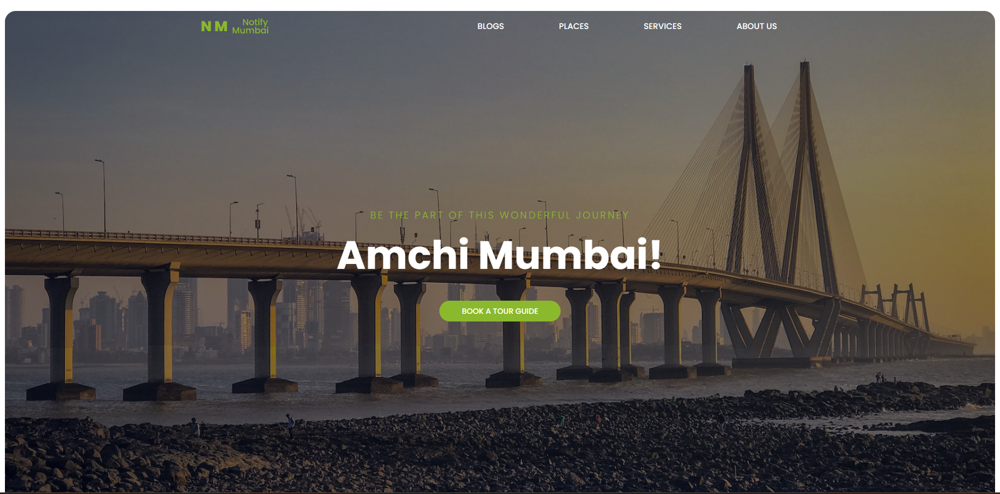
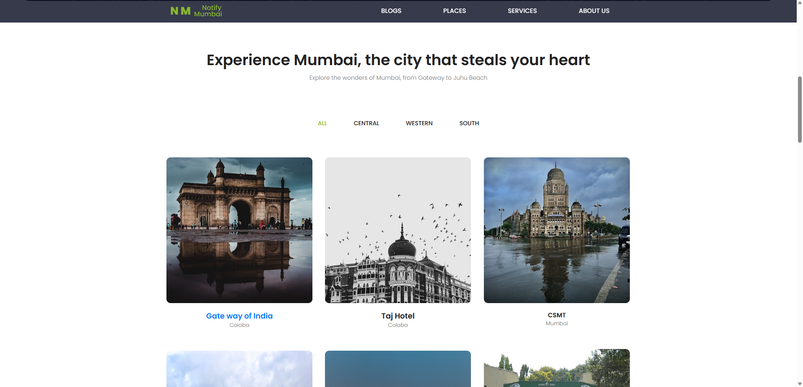

	
	<h4>A simple Tourism Website Portfolio which shows travel destinations across various part of Country. This theme is made using Bootstrap features several content sections, a responsive portfolio grid (tourist-places), window modals for each portfolio item, Blogs section and AboutUs Section</h4>

## [Live Preview]

## Problem Statement
Many tourists visiting Mumbai face challenges in exploring and experiencing the city's top attractions and hidden gems. These challenges can be summarized as follows:
Lack of Reliable Information: Tourists struggle to find comprehensive and up-to-date information about the best places to visit in Mumbai. Existing resources may be fragmented, outdated, or unreliable, leading to confusion and missed opportunities.
Difficulty in Navigation: Navigating through Mumbai's vast and bustling cityscape can be overwhelming for tourists. They often struggle to find efficient routes, reliable transportation options, and appropriate navigation guidance to reach their desired destinations.
Limited Local Insights: Tourists miss out on authentic local experiences and lesser-known attractions due to a lack of insights from local residents or experts. They may not have access to insider tips, off-the-beaten-path recommendations, or the opportunity to connect with the local culture and community.
By addressing these challenges, we can enhance the overall experience of tourists in Mumbai, enabling them to make the most of their visit and discover the true essence of the city.

## Solution
Our solution is to develop a comprehensive website that serves as a one-stop destination for tourists visiting Mumbai. This website will address the challenges mentioned in the problem statement by providing the following features:
Curated Information: The website will offer a curated list of must-visit places in Mumbai, including popular attractions, historical landmarks, cultural sites, and offbeat destinations. The information will be regularly updated to ensure accuracy and relevance, empowering tourists with reliable insights to plan their itinerary effectively.
Interactive Maps and Navigation: The website will integrate interactive maps and navigation tools to assist tourists in navigating the city. It will provide optimized routes, transportation options, and real-time updates to guide visitors from one location to another seamlessly. The maps will also highlight nearby amenities such as restaurants, restrooms, and parking areas.
Local Insights and Community Engagement: To enhance the experience of tourists, our website will feature local insights and recommendations from residents and travel experts. It will provide insider tips, hidden gems, and personalized suggestions to explore the city like a local. Additionally, the website will foster community engagement by allowing users to share their experiences, recommendations, and connect with fellow travelers.
By offering a user-friendly website with curated information, interactive navigation, and a platform for local insights, we aim to empower tourists with the necessary tools and resources to make their Mumbai visit memorable and immersive.

## Business Model

Our business model is based on a combination of advertising, partnerships, and premium features. The core offering of our website, providing comprehensive information and recommendations for tourists in Mumbai, will be available for free to users. This will help attract a large user base and establish our platform as a trusted resource.
Revenue Plan:
Advertising: We will monetize our platform through targeted advertising. By analyzing user preferences and behavior, we can offer relevant advertisements from local businesses, travel agencies, hotels, and restaurants. Advertising options may include display ads, sponsored listings, and promotional content.
Partnerships: We will establish partnerships with local businesses and service providers, offering them enhanced visibility and promotional opportunities on our platform. This can include featuring their offerings in recommended itineraries, providing exclusive discounts or packages, and offering premium listings for increased exposure.
Premium Features: To cater to the needs of more discerning travelers, we will offer premium features and services for a subscription fee. These may include personalized trip planning assistance, access to curated experiences, priority customer support, and additional content such as insider tips and hidden gems.
Data and Analytics: We will leverage the valuable user data collected on our platform to generate insights and analytics reports. These anonymized insights can be offered to businesses and organizations in the travel and tourism industry for market research and strategic decision-making.
By diversifying our revenue streams and creating value for both users and businesses, we aim to build a sustainable and profitable business model that supports the continuous growth and development of our Mumbai tour app.

## Presentation 
[Here](https://docs.google.com/presentation/d/1zxFOlGs31zYTm6RQAenTHiG_ksCLc7CdU69KjUSUlJw/edit?usp=sharing)
